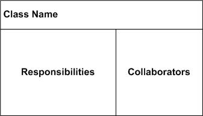

# PyCRC

Generate Class Responsibility Collaborator (CRC) Diagrams from python code

[](https://coveralls.io/github/IuryAlves/pycrc?branch=master)
[](https://travis-ci.org/IuryAlves/pycrc)
[](https://www.codacy.com/app/satriani-16/pycrc?utm_source=github.com&amp;utm_medium=referral&amp;utm_content=IuryAlves/pycrc&amp;utm_campaign=Badge_Grade)

# Table of contents
1. [What is CRC](#what_is_crc)
2. [Project Goal](#project_goal)
3. [Installing](#installing)
4. [Usage](#usage)
5. [Running Tests](#running_tests)
6. [Notes and Documentation](#notes_and_documentation)
7. [Contributing](#contributing)

## What is CRC ? <a name='what_is_crc'></a>

A Class Responsibility Collaborator (CRC) is a collection of standard index cards that have been divided into three sections.



A class represents a collection of similar objects, a responsibility is something that a class knows or does,
 and a collaborator is another class that a class interacts with to fulfill its responsibilities.


**More information:**[here](http://agilemodeling.com/artifacts/crcModel.htm)


## Project Goal <a name='project_goal'></a>

Imagine that your project have the class HtmlToMarkdown.

```python

class HtmlToMarkdown(object):
    """
    Converts html files to markdown.
    """

    def __init__(self, image_uploader):
        self.image_uploader = image_uploader

    # code
```

The responsibility of the class is to convert html files to markdown.
If the html has images, the class uses a colaborator called `image_uploader`
to upload the images to somewhere.

The CRC of this class could be represented as follows:


```
----------------------------------------|
|           HtmlToMarkdown              |
|---------------------------------------|
| Converts html files  | image_uploader |
|  to markdown         |                |
|                      |                |
-----------------------------------------
```

Where "Converts html files to markdown" is the responsibility of the class
and "image_uploader" is a colaborator


## Installing <a name='installing'></a>

    pip install -r requirements/base.txt


## Usage <a name='usage'></a>

    TODO

## Running tests <a name='running_tests'></a>

    pip install -r requirements/develop.txt
    tox

## Notes and Documentation <a name='notes_and_documentation'></a>

    TODO

## Contributing <a name='contributing'></a>

See [contributing](CONTRIBUTING.md) guide.

