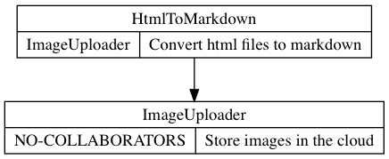

Welcome to CRCDiagram's documentation!
======================================

1. `What is CRC <what_is_crc_>`__
2. `How it works <how_it_works_>`__

   2.1 `Extracting CRCs from modules <crc_from_modules_>`__
3. `Installing <installing_>`__

CRCDiagram is a generator of Class Responsibility Collaboration diagrams in python (more languages will be available soon)
using `DOT language`_.

.. _DOT language: http://www.graphviz.org/doc/info/lang.html

.. _what_is_crc:

------------
What is CRC?
------------

A Class Responsibility Collaboration (CRC) is a collection of standard index cards that have been divided into three sections.

.. image:: _static/crc_card.jpg

| A class represents a collection of similar objects, a responsibility is something that a class knows or does,
 and a collaborator is another class that a class interacts with to fulfill its responsibilities.

`More information`_.

.. _More information: http://agilemodeling.com/artifacts/crcModel.htm

.. _how_it_works:

------------
How it works
------------

Suppose that you have a project with two classes: `HtmlToMarkdown` and `ImageUploader`.

`HtmlToMarkdown` converts html files to markdown files, but `HtmlToMarkdown` does not know what to do with images.
So it uses a collaborator called `ImageUploader`. `ImageUploader` knows how to store images in the cloud.

These classes could be write as follows::

   class HtmlToMarkdown(object):

      def __init__(self, image_uploader):
         self.image_uploader = image_uploader

   class ImageUploader(object):
      pass

To make :code:`crc-diagram` generate the CRC cards just add docstrings to the classes with these notations::

   class HtmlToMarkdown(object):
      """
      @collaborator: ImageUploader
      @responsibility: Convert html files to markdown
      """
      def __init__(self, image_uploader):
         self.image_uploader = image_uploader

   class ImageUploader(object):
      """
      @responsibility: Store images in the cloud
      """
      pass

.. note:: Any of the notations can be ignored, as you can see in `ImageUploader`
   and you can add more than one collaborator or responsibility.

Save this code as markdown_converter.py and run the following command::

   crc-diagram markdown_converter.py markdown_converter.png --view

This command will extract the CRC Cards and render as png. The :code:`--view` option is to open the rendered diagram.

And the result is:

.. _crc_from_modules:

Extracting CRCs from modules
----------------------------

It's also posible to extract CRCs from modules.
The only thing you must do is to add docstrings to a module::

    """
    file: module.py

    @collaborator: A module collaborator
    @responsibility: A module responsibility
    """

.. _installing:

----------
Installing
----------

You can get the library directly from PyPI::

   pip install crc-diagram

To render the diagrams you need to install dot:

* Ubuntu/Debian::

   apt-get update && apt-get install graphviz

* Fedora/CentOS::

   yum install graphviz

----------------------
Documentation Contents
----------------------

.. toctree::
   :maxdepth: 2
   :caption: Contents:

   command_line_usage
   api
   extending
   contributing
   license
